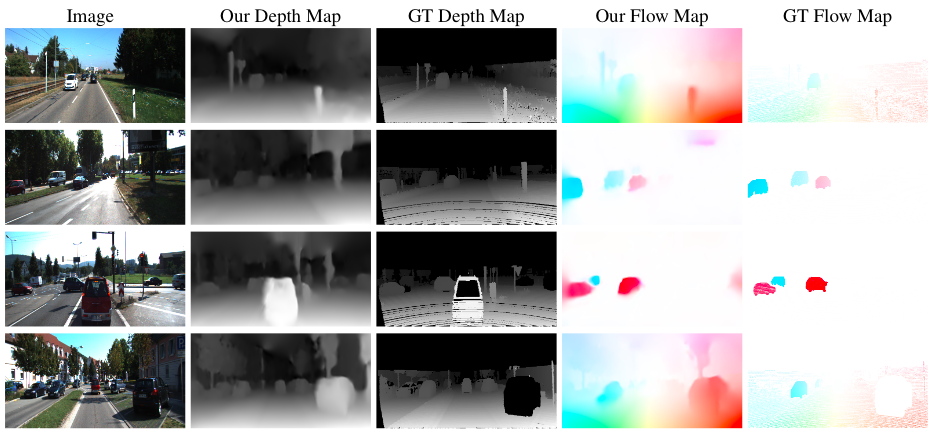

# Bridging Stereo Matching and Optical Flow via Spatiotemporal Correspondence
PyTorch implementaton of the following paper:
# Paper
[Bridging Stereo Matching and Optical Flow via Spatiotemporal Correspondence](https://people.cs.nctu.edu.tw/~walon/publications/lai2019cvpr.pdf) <br />
[Hsueh-Ying Lai](), [Yi-Hsuan Tsai](https://sites.google.com/site/yihsuantsai/home), [Wei-Chen Chiu](https://walonchiu.github.io) <br />
IEEE Conference on Computer Vision and Pattern Recognition (CVPR), 2019 (**poster**).

In this paper we propose a unified model for the unsupervised stereo matching and optical flow estimation using single convolutional neural network.

Please cite our paper if you find it useful for your research.

```
@inproceedings{lai19cvpr,
 title = {Bridging Stereo Matching and Optical Flow via Spatiotemporal Correspondence},
 author = {Hsueh-Ying Lai and Yi-Hsuan Tsai and Wei-Chen Chiu},
 booktitle = {IEEE Conference on Computer Vision and Pattern Recognition (CVPR)},
 year = {2019}
}
```

## Example Results



## KITTI Dataset
* Our model requires rectified stereo pairs with different timestamps from KITTI for training. \
We use two different split of KITTI 2015, **kitti** and **eigen**, for both training and testing. For additional testing, we test on the validation set of KITTI 2012. You can find them in the [filenames](utils/filenames) folder.
* Download the raw data of [KITTI Dataset](http://www.cvlibs.net/datasets/kitti/raw_data.php). This dataset is for training and eigen split evaluation.
```
wget -i utils/kitti_archives_to_download.txt -P ~/dataset/
```
* Download [KITTI 2015 scene flow dataset](http://www.cvlibs.net/datasets/kitti/eval_scene_flow.php) and saved in KITTI_PATH. This dataset is for optical flow and kitti split evaluation.
```shell
KITTI_PATH/
         |--training/
         |--testing/
```

## Installation
* This code was developed using Python 3.6 & PyTorch 0.3.1 & CUDA 9.0.
* Clone this repo
```shell
git clone https://github.com/lelimite4444/BridgeDepthFlow
cd BridgeDepthFlow
```

## Training
We use **kitti** split as example.
```shell
python train.py --data_path ~/dataset/
                --filenames_file ./utils/filenames/kitti_train_files_png_4frames.txt
                --checkpoint_path YOUR_CHECKPOINT_PATH
```
The chosen `--type_of_2warp` from 0 ~ 2 correponds to three types of different 2warp function in Figure 4 of our paper.
The `--model_name` flag allows you to choose which model you want to train on. We provide the PyTorch version of both monodepth and PWC-Net.

## Testing
We use the validation set of KITTI 2015 as example. The ground truth of optical flow includes occluded area.
* Test on optical flow
```shell
python test_flow.py --data_path KITTI_PATH
                    --filenames_file ./utils/filenames/kitti_flow_val_files_occ_200.txt
                    --checkpoint_path YOUR_CHECKPOINT_PATH/TRAINED_MODEL_NAME
```
* Test on stereo matching
```shell
python test_stereo.py --data_path KITTI_PATH
                    --filenames_file ./utils/filenames/kitti_stereo_2015_test_files.txt
                    --checkpoint_path YOUR_CHECKPOINT_PATH/TRAINED_MODEL_NAME
```
The network will output `disparities.npy`, containing all the estimated disparities of test data. You need to evaluate it by running:
```shell
python utils/evaluate_kitti.py --split kitti --predicted_disp_path ./disparities.npy --gt_path ~/dataset/
```

## Acknowledgement
* The evaluation code of stereo matching and the structure of monodepth is borrowed from [monodepth](https://github.com/mrharicot/monodepth)
* The PWC-Net is implemented by [NVlabs-PWC-Net](https://github.com/NVlabs/PWC-Net/tree/master/PyTorch)
* The warping function `Resample2d` and custom layers `Correlation` which PWC-Net relys on are implemented by [NVIDIA-flownet2](https://github.com/NVIDIA/flownet2-pytorch)
